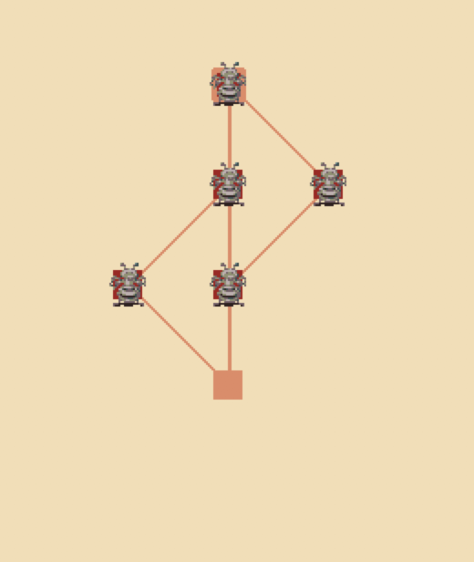

# lem-in

Each ant may move one room per turn

Only one ant may occupy a room at a time except for start and end

Minimize the number of turns required to move all ants from start to end

Developed for macOS High Sierra using clang-902.0.39.1

## Installation

```bash
make
```

This will create the lem-in executable

## lem-in

TODO: Add description of algorithm or something

### Usage

```bash
./lem-in < test_map
```

## Visualizer

Built with python3

### Dependencies:

* [pygame](https://www.pygame.org/news)

* [PyTweening](https://pypi.org/project/PyTweening/)

### Usage:

```bash
./lem-in < test_map | ./visu.py
```

### Navigation:

* Esc, Q: quit visualizer

* Up: increase ant speed

* Down: decrease ant speed

* Right: move ants

* 0: reset ant speed

* I: toggle instant ant movement

* Home, R: reset


